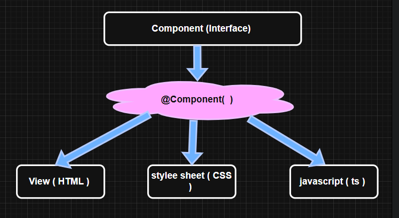

<h1 style="text-align:center;font-size:50px">Angular JS</h1>

- Angular is a popular, open-source Javascript **framework** ,used to build **complex**, **dynamic**, and **single-page web applications (SPAs)**.
- Angular is developed by **Google** in the year **2010**

### Key Advantages of AngularJS

- **Two-Way Data Binding** – Automatic synchronization between model and view.
- **MVC Architecture** – Structured code separation (Model-View-Controller).
- **Dependency Injection** – Easier code reuse and testing.
- **Directives** – Extend HTML with custom behavior.
- **Single Page Application (SPA) Support** – Fast, dynamic web app development.

### Difference between ReactJS and AngularJS

| Feature            | ReactJS                                          | AngularJS                                                                                     |
| ------------------ | ------------------------------------------------ | --------------------------------------------------------------------------------------------- |
| **Type**           | Library                                          | Framework                                                                                     |
| **Developed By**   | Facebook                                         | Google                                                                                        |
| **Language**       | JavaScript + JSX                                 | JavaScript + HTML templates                                                                   |
| **Data Binding**   | One-way binding                                  | Two-way binding                                                                               |
| **DOM**            | Virtual DOM                                      | Real DOM                                                                                      |
| **Architecture**   | Component-based                                  | MVC (Model-View-Controller)                                                                   |
| **Learning Curve** | Moderate                                         | Steep                                                                                         |
| **Performance**    | Faster due to virtual DOM                        | Slower compared to ReactJS                                                                    |
| **Routing**        | Requires external libraries (e.g., React Router) | Built-in                                                                                      |
| **Use Case**       | Better for dynamic and large applications        | Good for single-page applications (SPA) and enterprise dashboards where rapid setup is needed |

### Environmental Setup for Angular

1. Install Node JS - - - - - - - <a href="https://nodejs.org/en/download"> https://nodejs.org/en/download</a>
2. Install Typescript - - - - - - - npm install –g typescript
3. Install Angular CLI - - - - - - npm install @Angular/cli

### Test Environment:

    1. node –v [ For node js ]
    2. npm –v [ For package manager ]
    3. tsc [ For Typescript ]
    4. ng version [ For angular version ]

### Angular project Infrastructure:

    1.node_modules :-  It is a repository of all library install in your project. [ It belong to npm]
    2.Src:-     It comprises of project resources like components, services, pipes assets [ image, pdf ] etc.
    3.package.json:-    It provides the list of libraries used in application and allow to restore library. [ npm install –to restore ]
    4.package-lock.json:-   It contain meta data of package installed.
    5.tsconfig.json:- Typescript configuration for compatibility.
    6.tsconfig.app.json:- TS configuration for current application.

### Resources in “src” folder:

    1.app.ts:-  It is startup configure file which comprises of all configuration setting that are required to start angular application.
    2.Assets:- It comprises of non-dynamic file such as images and other static documents
    3.index.html :  it is the startup document, angular application allows start with index page.
    4.style.css:-   It contains global CSS ie. Style accessible to any component
    5.main.ts:-     It setup environment for development and testing angular application.

### Components in Angular :

- Components are the built in blocks in UI
- To create new Component using command
  ng g c ComponentName / ng generate Component ComponentName
- basically Component are class configure to Component interface
- Component interface imports from @angular/core
- Components are reusable

 

- To configure any component, it **requires the following properties in metadata**.

  | **Component**   | **Description**                                                                                                    |
  | --------------- | ------------------------------------------------------------------------------------------------------------------ |
  | **Selector**    | It specifies the directive name used to access the component in any page.                                          |
  | **Template**    | It specifies the markup for the template to render when the component is accessed on a page.                       |
  | **TemplateUrl** | It specifies the external HTML file that contains the markup to be rendered.                                       |
  | **Style**       | It specifies a set of inline styles used for markup in the component.                                              |
  | **StyleUrl**    | It specifies the external stylesheet (usually `.css`) used for the component.                                      |
  | **Animation**   | It defines a set of animations, which include CSS 2D and 3D animations used on HTML elements within the component. |

  ### Ways to Create Components in Angular

  Angular allows you to create components in **two ways**:

  ***

  #### 1. Using Inline Component

  - Using Inline Component (also called the inline technique) in Angular means defining the HTML (template) and CSS (styles) directly inside the component's TypeScript file, instead of linking to external .html or .css files.

  - Define the component directly in the `.ts` file using inline template and style.

  **Syntax:**

  ```ts
  @Component({
      selector: 'selector-name',
      template: 'markup content',
      imports: [],
      style: 'styling here'
  })

  ```

  **Example of Inline Component**

  1. Goto **app** folder in **src**
  2. Add a new folder **[home]** and create file - - - - - - - - - - - - - **home.ts**

  ```ts
  @Component({
    selector: "app-inline-example",
    template: `<h1>Welcome to Inline Component!</h1>`,
    styles: [
      `
        h1 {
          color: green;
          font-family: Arial;
        }
      `,
    ],
  })
  export class InlineExampleComponent {}
  ```

  > **Note**:
  >
  > 1.  Every time you create a new component, Angular looks for a **selector** to load in the main `app.html` file.
  > 2.  For example, if the selector is `"app-home"`, then in the `app.html` file, inside the `file`, write:

  ```html
  <app-home></app-home>
  ```

  > 3.  And imports `Home` Component in `app.ts`

  ```ts
  import { Component } from "@angular/core";
  import { Home } from "./home/home";
  @Component({
    selector: "app-root",
    imports: [Home],
    templateUrl: "./app.html",
    styleUrl: "./app.css",
  })
  export class App {}
  ```

#### 2. Using CLI Component

- Create a component using Angular **Command Line Interface (CLI)**.
- Use the following command:

```bash
ng g c ComponentName or ng generate component componentName
```
